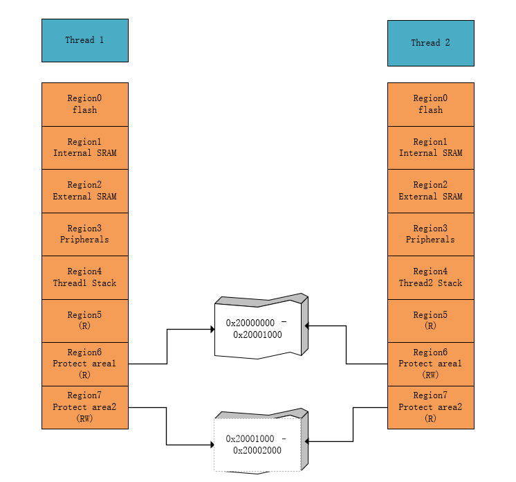

## MAL 组件初始化

不同的架构实现不同：

```c
rt_err_t rt_mpu_init(struct rt_mal_region *tables)
{
	if (mpu_ops->init)
    {
        return mpu_ops->init(tables);
    }
}
```

## MAL OPS 注册

不同的架构注册不同的接口：

```c
static struct rt_mpu_ops* mpu_ops = RT_NULL;
rt_err_t rt_mpu_ops_register(struct rt_mpu_ops *ops)
{
	mpu_ops = ops;
    
    return RT_EOK;
}

在 port/arm/arm_mal.c 文件中注册 ops
static struct rt_mpu_ops arm_mpu_ops =
{
    .init         = rt_mpu_arm_init,
    .switch_table = rt_mpu_arm_switch_table,
    .get_info     = rt_mpu_arm_get_info
};

/* 注册 arm mpu 接口 */
static void rt_mpu_arm_register(void)
{
    rt_err_t result;

    result = rt_mpu_ops_register(&arm_mpu_ops);

    RT_ASSERT(result == RT_EOK);
}
INIT_BOARD_EXPORT(arm_mpu_ops_register);
```

## MAL 表添加单条配置

单个 region 配置，在当前线程 regions 表，按顺序添加一条配置，实现方法如下图 ：


代码实现：

```c
rt_err_t rt_mpu_attach(rt_thread_t thread, void* addr, size_t size, rt_uint32_t attribute)
{
    if (thread->mpu_table.number == MPU_REGIONS_NUMBER)
    {
        LOG_E("no region can be config");
        return;
    }
}
```

## MAL 表添加多条配置

多个 region 配置，在当前线程 regions 表，按顺序添加多条配置，实现方法如下图 ：


代码实现如下：

```
struct mpu_regions
{
	void * address;
	rt_uint32_t size;
    rt_uint32_t attribute;
};

rt_err_t rt_mpu_attach_table(rt_thread_t thread, struch mpu_regions *regions)
{
	return RT_EOK;
}
```

## MAL 表删除

用户删除某条配置。根据 region 编号删除对应的 region 配置，删除该 region 后，此 region 后面的配置需要向前移动，实现方法如下图 ：


代码实现如下：

```c
rt_err_t rt_mpu_delete(rt_thread_t thread, rt_uint8_t region)
{
	/* 遍历 MPU tables ，找到地址为 address 的配置项并删除配置项， 该配置后边的其他项向前移动 */
    return RT_EOK;
}
```

## MAL 表更新

用户更新某条配置；例如：由可读可写配置为只读。根据 region 编号修改对应的 region 配置，实现方法如下图 ：


代码实现如下：

```c
rt_err_t rt_mpu_refresh(rt_thread_t thread, void *addr, size_t size, rt_uint32_t attribute, rt_uint8_t region)
{
    /* 更新当前线程 mpu 表 */
    /* 无效化其他未配置区域 */
    /* 从全局配置表中获取配置，从最高优先级 region 开始配置保护区域 */
	return RT_EOK;
    
}
```

## MAL 表插入

在指定位置插入配置。插入后，原位置的配置自动向后移动，实现方法如下图 ：


代码实现如下：

```c
/* pos 为插入的 region 位置 */
rt_err_t rt_mpu_insert(rt_thread_t thread, void *addr, size_t size, rt_uint32_t attribute, rt_uint8_t region)
{
	return RT_EOK;
}
```

## MAL 表切换

在线程切换时，快速切换 mpu 表配置

```c
switch_to_thread
	IMPORT  rt_mpu_table_switch
	IMPORT  rt_current_thread

	.
    .
    .

    PUSH    {r0-r3, r12, lr}
    LDR     r1, =rt_current_thread
    LDR     r0, [r1]
    BL      rt_mpu_table_switch     ; switch mpu table 
    POP     {r0-r3, r12, lr}

void rt_mpu_table_switch(struct rt_thread* thread)
{
	mpu_ops->switch_table(thread);
}
```

## 获取 MAL 配置信息

```c
#define GET_MPU_REGIONS_NUMBER 
#define GET_MPU_REGIONS_CONFGIG

rt_err_t rt_mpu_get_info(rt_thread_t thread, rt_uint32_t type, void *arg)
{
	if (mpu_ops->get_info)
    {
        mpu_ops->get_info(thread, type, arg);
    }
}
```

## 设置保护区域

当前系统中最多可设置两个被保护区域。对于内存区域 `0x20000000 - 0x20001000`，只有线程 2 具有读写权限，其他线程禁止写该区域；对于内存区域 `0x20001000 - 0x20002000`，只有线程 1 具有读写权限，其他线程禁止写该区域：



代码实现如下：

```c
struct mpu_protect_regions      /* 保护区域结构体 */
{
    rt_thread_t thread;         /* 该线程具有访问权限 */
    struct rt_mal_region tables;
};

static struct mpu_region_protect rt_mpu_protect[2];

rt_err_t rt_mpu_enable_protect_area(rt_thread_t thread, void *addr, size_t size, rt_uint32_t attribute)
{
	return RT_EOK;
}
```

## 关闭保护区域

通过调用接口 `rt_err_t rt_mpu_disable_protect_area(rt_thread_t thread, rt_uint8_t region)` ，取消线程保护区域。如下图所示，取消了线程 1 对于内存区域 `0x20001000 - 0x20002000` 的只读写权限：


代码实现如下：

```c
rt_err_t rt_mpu_disable_protect_area(rt_thread_t thread, rt_uint8_t region)
{
	return RT_EOK;
}
```

## MAL 异常处理

```c
void rt_mpu_exception_handler(rt_thread_t thread, void* addr, rt_uint32_t attribute)
{
    .
    .
    .

    if (thread->mpu_hook)
    {
        thread->mpu_hook(addr, attribute); /* 线程 memory handle 异常回调 */
    }
    else
    {
        return;
    }
}
```

## 注册回调

线程触发 MPU 异常时回调函数

```c
void rt_mpu_exception_sethook(rt_thread_t thread, void (*hook)(void* addr, rt_uint32_t attribute))
{
    thread->mpu_hook = hook;
}
```

触发 MPU 异常回调：

```c
void MemManage_Handler(void)
{
    rt_mpu_exception_handler(thread, addr, attribute);
}
```


