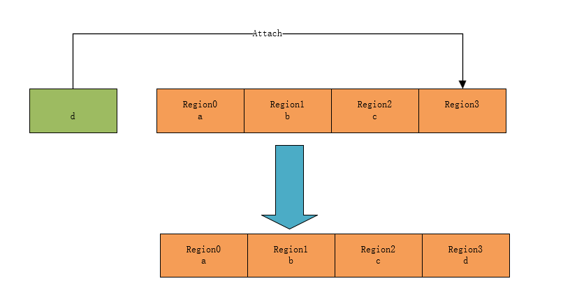

# MAL API 详解

## 应用层用户调用的 API 

### MAL 表添加单条配置

单个 region 配置，在当前线程 regions 表按顺序添加一条配置：

```c
rt_err_t rt_mpu_attach(rt_thread_t thread, void* addr, size_t size, rt_uint32_t attribute);
```

| 参数      | 描述 |
| --------- | ---- |
| thread    |      |
| addr      |      |
| size      |      |
| attribute |      |

实现方法如下图：



### MAL 表添加多条配置

多个 region 配置，在当前线程 regions 表，按顺序添加多条配置，

```c
rt_err_t rt_mpu_attach_table(rt_thread_t thread, struct mpu_regions *regions);
```

| 参数    | 描述 |
| ------- | ---- |
| thread  |      |
| regions |      |

实现方法如下图 ：


### MAL 表删除

用户删除某条配置。根据 region 编号删除对应的 region 配置，删除该 region 后，此 region 后面的配置需要向前移动，

```c
rt_err_t rt_mpu_delete(rt_thread_t thread, rt_uint8_t region);
```

| 参数 | 描述 |
| ---- | ---- |
|      |      |
|      |      |
|      |      |

实现方法如下图 ：


### MAL 表更新

用户更新某条配置；例如：由可读可写配置为只读。根据 region 编号修改对应的 region 配置：

```c
rt_err_t rt_mpu_refresh(rt_thread_t thread, void *addr, size_t size, rt_uint32_t attribute, rt_uint8_t region);
```

| 参数 | 描述 |
| ---- | ---- |
|      |      |
|      |      |
|      |      |

实现方法如下图 ：


xxx


## 架构移植调用的 API 

### MAL OPS 注册

```c
rt_err_t rt_mpu_ops_register(struct rt_mpu_ops *ops);
```


## BSP 移植调用的 API 

### MAL 组件初始化

```c
rt_err_t rt_mpu_init(struct rt_mal_region *tables);
```


### MAL 异常回调

```c
void rt_mpu_exception_handler(rt_thread_t thread, void* addr, rt_uint32_t attribute);
```

