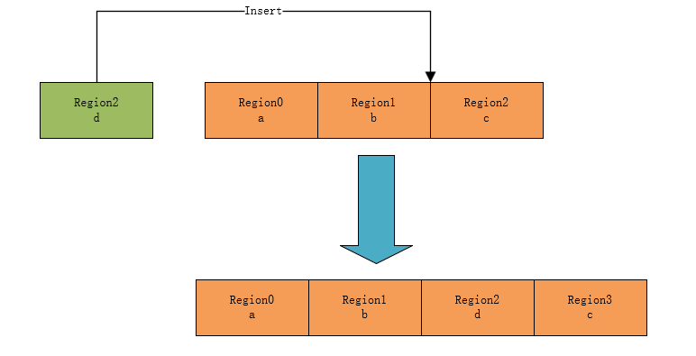

# MAL API 详解

## 应用层用户调用的 API

### MAL 表添加单条配置

单个 region 配置，在当前线程 regions 表按顺序添加一条配置：

```c
rt_err_t rt_mpu_attach(rt_thread_t thread, void* addr, size_t size, rt_uint32_t attribute);
```

| 参数       | 描述                                                         |
| ---------- | ------------------------------------------------------------ |
| thread     | 线程句柄。线程句柄由用户提供出来，并指向对应的线程控制块内存地址 |
| addr       | 内存区域地址                                                 |
| size       | 内存区域大小                                                 |
| attribute  | 内存区域访问特性。包含读写权限、可缓冲、可缓存等             |
|  返回值  |                                                              |
| RT_EOK     | 添加 region 配置成功                                         |
| OTHERS     | 添加 region 配置失败                                         |

将内存区域 d 添加到线程 thread 的 region 配置表中，实现方法如下图：


### MAL 表添加多条配置

多个 region 配置，在当前线程 regions 表，按顺序添加多条配置，

```c
rt_err_t rt_mpu_attach_table(rt_thread_t thread, struct mpu_regions *regions);
```

| 参数       | 描述                                                         |
| ---------- | ------------------------------------------------------------ |
| thread     | 线程句柄。线程句柄由用户提供出来，并指向对应的线程控制块内存地址 |
| regions    | 多个 region 区域配置块                                       |
|  返回值  |                                                              |
| RT_EOK     | 添加成功                                                     |
| OTHERS     | 添加失败                                                     |

将内存区域 d 和 e 添加到线程 thread 的 region 表中，实现方法如下图 ：


### MAL 表删除单条配置

用户删除某条配置。根据 region 编号删除对应的 region 配置，删除该 region 后，此 region 后面的配置需要向前移动，

```c
rt_err_t rt_mpu_delete(rt_thread_t thread, rt_uint8_t region);
```

| 参数       | 描述                                                         |
| ---------- | ------------------------------------------------------------ |
| thread     | 线程句柄。线程句柄由用户提供出来，并指向对应的线程控制块内存地址 |
| region     | 要删除的 region 编号                                         |
|  返回值  |                                                              |
| RT_EOK     | 添加成功                                                     |
| OTHERS     | 添加失败                                                     |


从线程 thread 的 region 配置表中删除 region1 的配置，实现方法如下图 ：


### MAL 表更新单条配置

用户更新某条配置；例如：由可读可写配置为只读。根据 region 编号修改对应的 region 配置：

```c
rt_err_t rt_mpu_refresh(rt_thread_t thread, void *addr, size_t size, rt_uint32_t attribute, rt_uint8_t region);
```

| 参数 | 描述 |
| ---- | ---- |
| thread | 线程句柄。线程句柄由用户提供出来，并指向对应的线程控制块内存地址 |
| addr | 新的内存区域地址 |
| size | 新的内存区域大小 |
| attribute | 新的内存区域访问特性 |
| region | 要更新的 region 编号 |
|  返回值  |                                                              |
| RT_EOK     | 添加成功                                                     |
| OTHERS     | 添加失败                                                     |

更新线程 thread 的 region 配置表中 region2 区域的配置信息，实现方法如下图 ：


### MAL 表插入单条配置

用户在 mpu 配置表中插入某条配置，如果原位置有 region 配置，原位置及以后的配置自动向后移动：

```c
rt_err_t rt_mpu_insert(rt_thread_t thread, void *addr, size_t size, rt_uint32_t attribute, rt_uint8_t region);
```

| 参数         | 描述                                                         |
| ------------ | ------------------------------------------------------------ |
| thread       | 线程句柄。线程句柄由用户提供出来，并指向对应的线程控制块内存地址 |
| addr         | 内存区域地址                                                 |
| size         | 内存区域大小                                                 |
| attribute    | 内存区域访问特性                                             |
| region       | 要插入的 region 编号                                         |
|  返回值  |                                                              |
| RT_EOK       | 添加成功                                                     |
| OTHERS       | 添加失败                                                     |

实现方法如下图 ：



### 获取 MAL 信息

通过使用该接口，可以获取 MAL 配置表信息：

```c
rt_err_t rt_mpu_get_info(rt_thread_t thread, rt_uint32_t type, void *arg);
```

| 参数         | 描述                                                         |
| ------------ | ------------------------------------------------------------ |
| thread       | 线程句柄。线程句柄由用户提供出来，并指向对应的线程控制块内存地址 |
| type         | 信息类型                                                     |
| arg          | 存放信息地址                                                 |
|  返回值  |                                                              |
| RT_EOK       | 查询成功                                                     |
| OTHERS       | 查询失败                                                     |

type 的取值定义如下表所示：

| 参数                    | 描述                                  |
| ----------------------- | ------------------------------------- |
| GET_MPU_REGIONS_NUMBER  | 获取当前线程 MAL 已配置的 region 数目 |
| GET_MPU_REGIONS_CONFGIG | 获取当前线程 MAL 所有 region 配置     |

### 添加线程保护区域

通过使用此接口，可以实现内存隔离，即某一任务用到的内存区域不会被其他任务破坏。

```c
rt_err_t rt_mpu_enable_protect_area(rt_thread_t thread, void *addr, size_t size, rt_uint32_t attribute);
```

| 参数       | 描述                                                         |
| ---------- | ------------------------------------------------------------ |
| thread     | 线程句柄。线程句柄由用户提供出来，并指向对应的线程控制块内存地址 |
| addr       | 内存区域地址                                                 |
| size       | 内存区域大小                                                 |
| attribute  | 内存区域访问特性                                             |
|  返回值  |                                                              |
| RT_EOK     | 添加成功                                                     |
| OTHERS     | 添加失败                                                     |

### 删除线程保护区域

通过使用此接口，可以将 `rt_mpu_enable_protect_area` 接口设置的保护区域无效化：

```c
rt_err_t rt_mpu_disable_protect_area(rt_thread_t thread, rt_uint8_t region);
```

| 参数       | 描述                                                         |
| ---------- | ------------------------------------------------------------ |
| thread     | 线程句柄。线程句柄由用户提供出来，并指向对应的线程控制块内存地址 |
| region     | 要删除的 region 编号                                         |
| 返回值 |                                                              |
| RT_EOK     | 添加成功                                                     |
| OTHERS     | 添加失败                                                     |

### 设置线程异常回调

用户可以通过使用此接口 `rt_mpu_exception_sethook`，注册线程内存访问错误异常回调：

```c
void rt_mpu_exception_sethook(rt_thread_t thread, void (*hook)(void* addr, rt_uint32_t attribute));
```

| 参数       | 描述                                                         |
| ---------- | ------------------------------------------------------------ |
| thread     | 线程句柄。线程句柄由用户提供出来，并指向对应的线程控制块内存地址 |
| hook       | 异常回调函数                                         |

伪代码实现如下：

```c
static rt_thread_t thread = RT_NULL;

static void thread1_mpu_exception(void* addr, rt_uint32_t attribute)
{
	...
}

/* register mpu exception for thread1 */
static void register_hook()
{
    rt_mpu_exception_sethook(thread, thread1_mpu_exception);
}
```

### MAL 配置表切换

mal 组件通过使用此接口，完成 mpu 配置切换。针对不同的架构，该函数的实现方式会有所区别

```c
void rt_mpu_table_switch(rt_thread_t thread);
```

| 参数       | 描述                                                          |
| ---------- | ------------------------------------------------------------ |
| thread     | 线程句柄。线程句柄由用户提供出来，并指向对应的线程控制块内存地址   |

代码如下所示：

```c
void rt_mpu_table_switch(rt_thread_t thread)
{
    if (mpu_ops->switch_table == RT_NULL)
    {
        LOG_E("mpu switch table ops is null.");
    }

    mpu_ops->switch_table(thread, mpu_protect_area_num, mpu_protect_areas);
}
```

### 设置 MAL region 访问权限

用户可以通过该接口，设置 region 的访问权限：

```c
rt_inline rt_uint32_t rt_mpu_region_attribute(rt_uint32_t access,
                                            rt_uint32_t execute,
                                            rt_uint32_t shareable,
                                            rt_uint32_t cacheable,
                                            rt_uint32_t bufferable,
                                            rt_uint32_t type_extern,
                                            rt_uint32_t sub_region)
```

| 参数        | 描述           |
| ----------- | -------------- |
| access      | 访问权限       |
| execute     | 可取指         |
| shareable   | 可共享         |
| cacheable   | 可缓存         |
| bufferable  | 可缓冲         |
| type_extern | 类型拓展       |
| sub_region  | 子 region 支持 |

取值如下：

```c
/* access 参数的取值范围如下 */
#define RT_MPU_REGION_NO_ACCESS                          0x0U
#define RT_MPU_REGION_PRIVILEGED_RW                      0x1U
#define RT_MPU_REGION_PRIVILEGED_RW_UNPRIV_RO            0x2U
#define RT_MPU_REGION_RW                                 0x3U
#define RT_MPU_REGION_PRIVILEGED_RO                      0x5U
#define RT_MPU_REGION_RO                                 0x6U

/* execute 参数的取值范围如下 */
#define RT_MPU_REGION_EXECUTE_ENABLE                     0x0U
#define RT_MPU_REGION_EXECUTE_DISABLE                    0x1U

/* shareable 参数的取值范围如下 */
#define RT_MPU_REGION_SHAREABLE_ENABLE                   0x1U
#define RT_MPU_REGION_SHAREABLE_DISABLE                  0x0U

/* cacheable 参数的取值范围如下 */
#define RT_MPU_REGION_CACHEABLE_ENABLE                   0x1U
#define RT_MPU_REGION_CACHEABLE_DISABLE                  0x0U

/* bufferable 参数的取值范围如下 */
#define RT_MPU_REGION_BUFFERABLE_ENABLE                  0x1U
#define RT_MPU_REGION_BUFFERABLE_DISABLE                 0x0U

/* type_extern 参数的取值范围如下 */
#define RT_MPU_REGION_TEX_ENABLE                         0x1U
#define RT_MPU_REGION_TEX_DISABLE                        0x0U

/* sub_region 参数的取值范围如下 */
#define RT_MPU_SUB_REGION_DEFAULT						 0x0U
```

## 架构移植调用的 API

### MAL OPS 注册

对于不同的架构，如：arm、riscv、mips；需要实现不同的 ops。

```c
rt_err_t rt_mpu_ops_register(struct rt_mpu_ops *ops);
```

| 参数        | 描述                                                         |
| ---------- | ------------------------------------------------------------ |
| ops        | 每个架构对 mal 的不同实现方法 |


目前 mal ops 需要实现以下接口：

```c
struct rt_mpu_ops
{
   rt_err_t (*init) (struct rt_mal_region *regions); /* 初始化函数 */
   void (*switch_table) (rt_thread_t thread, rt_uint8_t mpu_protect_area_num, struct mpu_protect_regions* mpu_protect_areas);
   /* 表切换函数 */
   rt_err_t (*get_info) (rt_thread_t thread, rt_uint32_t type, void *arg); /* 获取配置信息 */
};
```

## BSP 移植调用的 API

### MAL 组件初始化

使用 mal 组件前，需要对 mal 组件初始化：

```c
rt_err_t rt_mpu_init(struct rt_mal_region *tables);
```

| 参数   | 描述              |
| ------ | ----------------- |
| tables | mal region 配置表 |
| 返回值 |                   |
| RT_EOK | 初始化成功        |
| OTHERS | 初始化失败        |

### MAL 异常回调

mal 异常处理接口：

```c
void rt_mpu_exception_handler(rt_thread_t thread, void* addr, rt_uint32_t attribute);
```

| 参数      | 描述                                                         |
| --------- | ------------------------------------------------------------ |
| thread    | 线程句柄。线程句柄由用户提供出来，并指向对应的线程控制块内存地址 |
| addr      | 异常访问内存地址                                             |
| attribute | 异常访问错误类型                                             |
