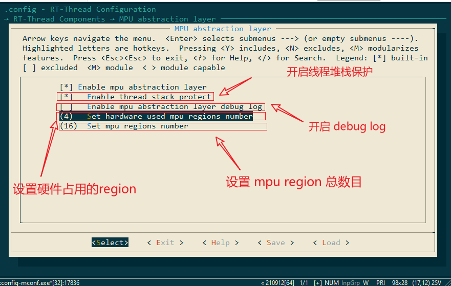

# MAL 使用例程

本文档将介绍如何使用 MAL 组件进行内存保护。该文档以 ART-PI 开发板为例：

## 开启 MAL 组件

在工程目录下，打开 `env` 工具，使能 MPU 抽象层：



## 设置线程保护区域

设置一块内存区域，只有当前线程具有访问权限，其他线程禁止访问。

   ```c
   #define THREAD_MEMORY_SIZE 1024
   uint8_t protect_memory[THREAD_MEMORY_SIZE] __attribute__((aligned(THREAD_MEMORY_SIZE)));
   
   static void thread1_entry(void *param)
   {
      while (1)
      {
          protect_memory[0] = 1; /* mpu1 thread will trigger memmory fault */
          rt_thread_mdelay(1000);
      }
   }
   
   static void mpu1_thread_handle(void *addr, rt_uint32_t attribute)
   {
   	rt_kprintf("error memory addr: %p\n", addr);
   }
   
   int main(void)
   {
       /* set LED0 pin mode to output */
       rt_pin_mode(LED0_PIN, PIN_MODE_OUTPUT);
       mpu_init();
       rt_thread_init(&tid, "mpu", thread1_entry, RT_NULL, thread_stack, THREAD_MEMORY_SIZE, THREAD_PRIORITY, 20);
       {
           rt_mpu_enable_protect_area(&tid, protect_memory, THREAD_MEMORY_SIZE, RT_MPU_REGION_PRIVILEGED_RW); /* 设置保护区域 */
           rt_thread_startup(&tid);
       }
   
       rt_thread_init(&tid1, "mpu1", thread1_entry, RT_NULL, thread1_stack, THREAD_MEMORY_SIZE, THREAD_PRIORITY, 20);
       {
           rt_mpu_exception_sethook(&tid1, mpu1_thread_handle);
           rt_thread_startup(&tid1);
       }
   
       while (1)
       {
           rt_pin_write(LED0_PIN, PIN_HIGH);
           rt_thread_mdelay(500);
           rt_pin_write(LED0_PIN, PIN_LOW);
           rt_thread_mdelay(500);
       }
   }
   ```

当线程 `mpu1` 访问内存区域 `protect_memory` 时，就会触发内存异常中断服务。如果该线程注册了 mpu 异常回调函数，mal 组件层就会调用该函数。


## 设置线程受限区域

只针对当前线程，禁止对某块区域进行读写操作：

```c
#define THREAD_MEMORY_SIZE 1024
uint8_t protect_memory[THREAD_MEMORY_SIZE] __attribute__((aligned(THREAD_MEMORY_SIZE)));

static void thread1_entry(void *param)
{
   while (1)
   {
       protect_memory[0] = 1;
       rt_thread_mdelay(1000);
   }
}

static void mpu_thread_handle(void *addr, rt_uint32_t attribute)
{
	rt_kprintf("error memory addr: %p\n", addr);
}

int main(void)
{
    /* set LED0 pin mode to output */
    rt_pin_mode(LED0_PIN, PIN_MODE_OUTPUT);
    mpu_init();
    rt_thread_init(&tid, "mpu", thread1_entry, RT_NULL, thread_stack, THREAD_MEMORY_SIZE, THREAD_PRIORITY, 20);
    {
        rt_mpu_attach(&tid, protect_memory, THREAD_MEMORY_SIZE, RT_MPU_REGION_NO_ACCESS);
        rt_mpu_exception_sethook(&tid, mpu_thread_handle);
        rt_thread_startup(&tid);
    }

    while (1)
    {
        rt_pin_write(LED0_PIN, PIN_HIGH);
        rt_thread_mdelay(500);
        rt_pin_write(LED0_PIN, PIN_LOW);
        rt_thread_mdelay(500);
    }
}
```

当线程 `mpu` 访问内存区域 `protect_memory` 时，就会触发 mpu 异常。

